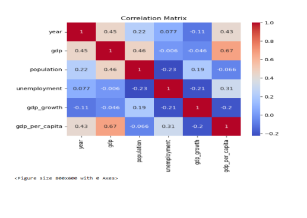
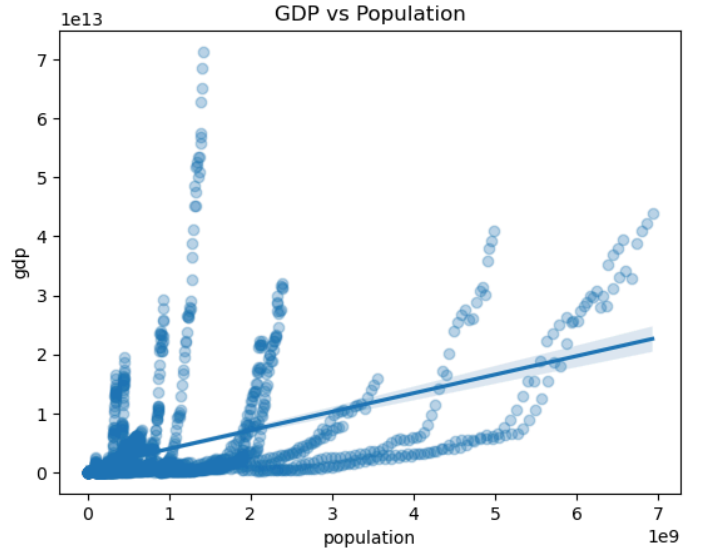
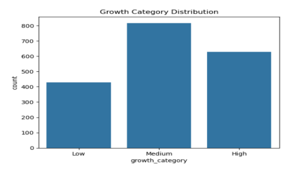
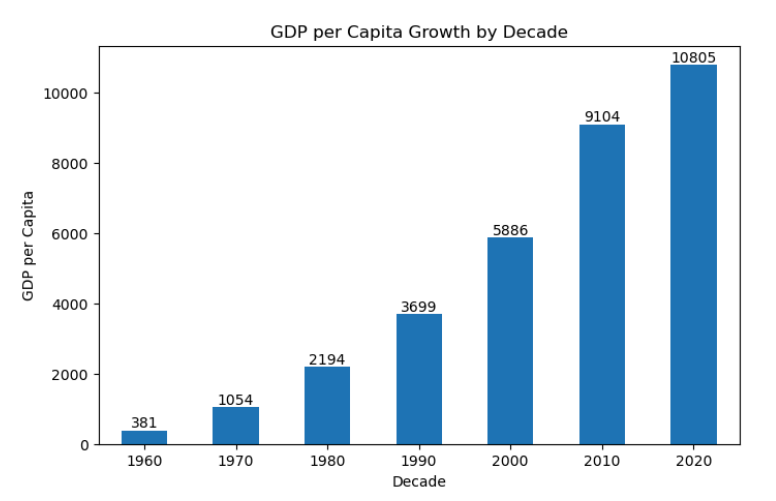
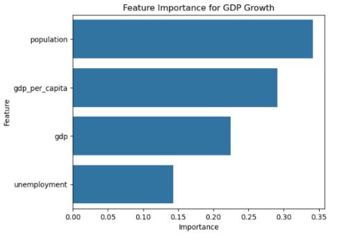
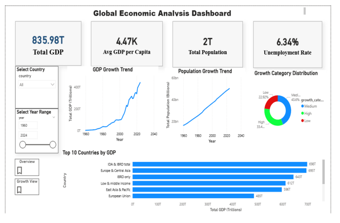

# 🌍 Global Economic Analysis – WORLD BANK  
### Python | Power BI | Economic Data Analytics  

📍 Data Analytics Project | Economic Insights | Interactive Dashboard  

## 📌 Project Overview

This project analyzes global economic trends using **World Bank data** to understand patterns in **GDP, population, and unemployment** across countries.
The goal: **Transform raw data into actionable insights and build an interactive dashboard for data-driven decision making.**

## 🎯 Objective

- Analyze global economic trends over time  
- Compare economic performance across countries  
- Identify growth patterns and relationships  
- Build an interactive dashboard for exploration  

## 📊 Key Analysis Areas

- Data Collection using World Bank API  
- Data Cleaning & Preprocessing  
- Exploratory Data Analysis (EDA)  
- Correlation & Trend Analysis  
- Feature Engineering  
- Interactive Dashboard (Power BI)  

## 📈 Major Insights

- Global GDP shows **exponential growth**, especially after 2000  
- Population growth is **steady and linear**  
- Economic growth is driven by **productivity, not just population**  
- Unemployment remains **stable (~5–7%) globally**  
- Majority of countries fall under **medium growth category**  
- Strong economies are concentrated in **specific regions**  

## 📷 Visual Insights

### 🔍 Correlation Analysis

- GDP strongly correlates with GDP per capita  
- Population has moderate impact on GDP  
- Weak relationship between unemployment and growth  

### 📈 GDP vs Population

- GDP increases with population but not proportionally  
- Highlights efficiency and productivity differences  

### 📊 Growth Category Distribution

- Medium growth dominates (~44%)  
- Indicates global economic stability  

### 📈 GDP per Capita Growth

- Continuous increase across decades  
- Reflects improving individual economic output  

### 📊 Feature Importance

- Population is key driver of GDP growth  
- GDP per capita plays significant role  
- Unemployment has lower impact  

### 📊 Power BI Dashboard

- Interactive dashboard for global and country-level analysis  

## 🛠 Tools Used

- Python  
- Pandas & NumPy  
- Matplotlib & Seaborn  
- World Bank API  
- Power BI  
- Jupyter Notebook  

## 🚀 Dashboard Features

### 🔹 KPI Cards
- Total GDP  
- Avg GDP per Capita  
- Total Population  
- Unemployment Rate  

### 🔹 Visualizations
- GDP Growth Trend  
- Population Growth Trend  
- Top Countries by GDP  
- Growth Category Distribution  

### 🔹 Interactivity
- Country slicer  
- Year range filter  
- Drill-through for country details  
- Bookmarks for navigation  

## 💡 Business Recommendations

- Focus on **productivity-driven economic growth**  
- Improve **employment generation strategies**  
- Reduce **global economic imbalance**  
- Use **interactive dashboards for decision-making**  

## 🎯 Business Impact

This project helps in:

- Understanding global economic trends  
- Identifying growth patterns across countries  
- Supporting policy and business decisions  
- Enabling data-driven economic analysis  

## 📁 Repository Structure
Global-Economic-Analysis/
│
├── screenshots/
│ ├── correlation.png
│ ├── gdp_vs_population.png
│ ├── growth_distribution.png
│ ├── gdp_per_capita_growth.png
│ ├── feature_importance.png
│ └── dashboard.png
│
├── dataset
├── notebook
├── powerbi_dashboard.pbix
└── README.md

## 👩‍💻 Author
**Afifa Kanchwala**

## ⭐ If you like this project, give it a star!
